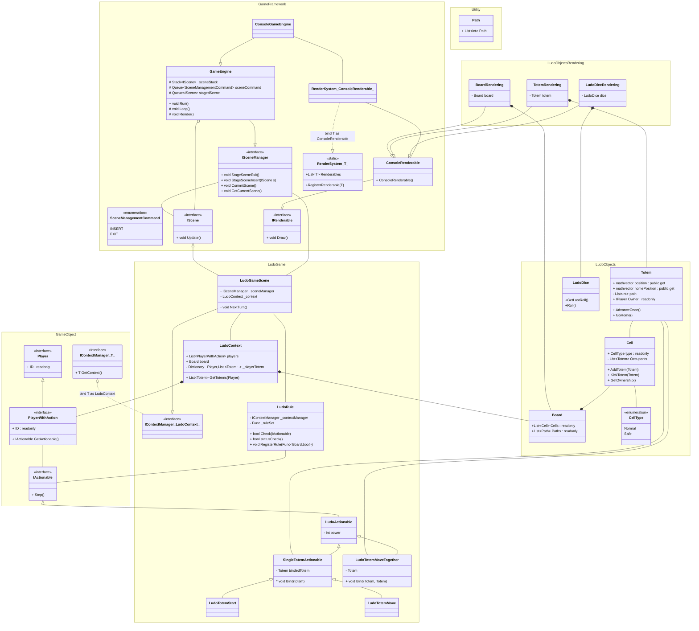
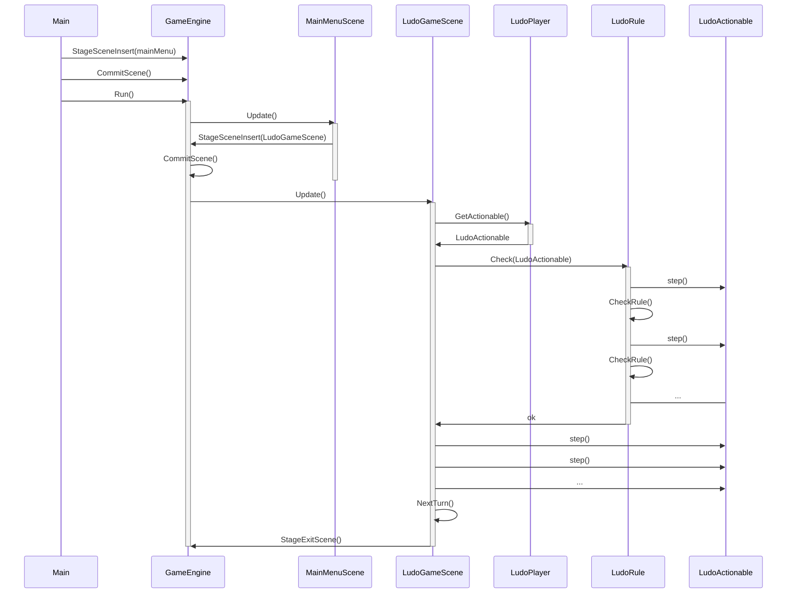
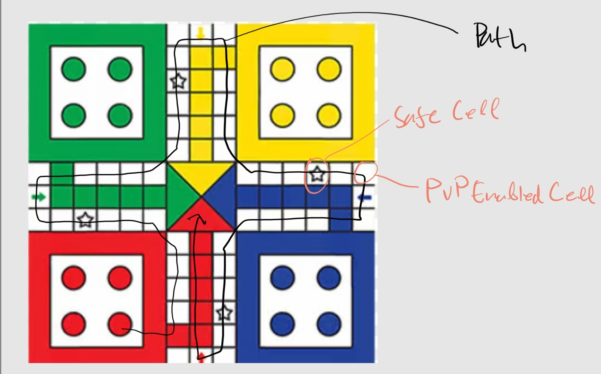

# Ludo Class Diagram

## Class Diagram



---

## Rough Sequence Diagram



---

## Design Documentation

### GameFramework

The GameFramework namespace contains the classes to manage the game. It contains system for the game loop management, scene management, scene context, and render system.

#### GameEngine Class

The GameEngine class defines the way how the game is structured.

##### Run() and Loop()

Typically, implementation of the Run() method will run a setup code for the game and ten will call Loop() method which could run indefinitely.

```c#
public void Run(){
    // code to setup some things...
    this.Loop();
    // code to handle exits...
}
```

The following snippet is the expected implementation of Loop()

```c#
protected void Loop(){
    while(True){
        this.CommitScene(); // read ISceneManager
        this.GetCurrentScene().Update();
        this.Render();
    }
}
```

For game with physics, the time elapsed between the Loop call can be an important information.
In this case, the time elapsed could be handled as an internal state of each scene, that is, each scene can measure the time difference by itself every time the Update() method is called.
If such methode doesn't fancy you, you can always derive the GameEngine class and implement a Loop() method with delta time.

##### Render()

The Render() method is for rendering the scene into a render media.
Its implementation should iterate the static member Renderables of the RenderSystem class and call their Draw() method.
The Render() method could be called inside the Loop() method like the code snippet above, or it could also run inside a thread.

```c#
protected void Render(){
    foreach(IRenderable obj in RenderSystem<ConsoleRenderable>.Renderables){
        obj.Draw();
    }
}
```

#### IScene interface

IScene is the interface for each scene in a game.
A scene could be the main game, the menu, the pause menu, credit, and etc.
Each scene must implement Update() method which would be called in the GameEngine's Loop.

#### ISceneManager interface

This is an interface to enable scene management.
Each class that implement this interface must have a container for IScenes and SceneManagementCommand, and should pass its own reference to each IScene inside of that class.
The methods of this interface will manipulate the IScene's container.
This enable each IScene to control the flow of the program by providing a restricted interface to the GameEngine.

##### Staging methods

To make sure modification to IScene's container happen not while a scene's Update() method is running, the modification should be staged first and then applied at once in CommitScene() method.
This staging is done by pushing into a the SceneManagementCommand's container.
Below is an implementation example of the staging and commit.

```c#
public void StageSceneExit(){
    // using queue as command container
    this.sceneCommand.Enqueue(SceneManagementCommand.EXIT);
}
public void StageSceneInsert(IScene scene){
    this.sceneCommand.Enqueue(SceneManagementCommand.INSERT);
    // using queue to save staged scene, different from IScene container
    this.stagedScene.Enqueue(scene);
}
public void CommitScene(){
    while(this.sceneCommand.Count > 0){
        switch(this.sceneCommand.Peek()){
            case SceneManagementCommand.EXIT:
                this.sceneStack.Pop();
                break;
            case SceneManagementCommand.INSERT:
                this.sceneStack.Push(
                    this.stagedScene.Dequeue()
                );
                break;
        }
        this.sceneCommand.Dequeue();
    }
}
```

#### Rendering system

This design of the rendering system in this framework can be adapted to specific rendering device.
To do that, you must create a class for the rendering device.
In the class diagram, rendering on console is provided as an example.
When using console as rendering device, you can create a ConsoleRenderable class that implements the IDrawable interface.
Later, if an object want to be made renderable on console, it can simply inherit from ConsoleRenderable.
Additionally, in the constructor of ConsoleRenderable, or any class that implements IRenderable, must register themself to the RenderSystem class like shown in code below.
This way, all instances of ConsoleRenderable can be rendered like in GameEngine [Render() method](#render)

```c#
public ConsoleRenderable(){
    RenderSystem<ConsoleRenderable>.RegisterRenderable(this);
}
```

To decouple GameEngine class from the rendering device, you should derive the GameEngine class to a specific rendering device to override the Render() method.
So, to use console as rendering device, a ConsoleGameEngine class like in the diagram should be made.
Another way to do it to set the GameEngine class to be generic.
But, I don't find that elegant.
It's up to you how you will implmenent this.

### GameObject

This namespace contains the common objects that may exist in a game such as players, actions, and context manager.

#### Player

The player interface is simply tells the implementers to have ID property.
It could only be useful only after being realized to a class or another interface with more method like PlayerWithAction.
With this interface, we can pass realizations of Player to objects that only needs the ID of an instance of Player, without them accidentaly call methods they shouldn't call.

#### IActionable and PlayerWithAction

IActionable is an interface in which all action performed in a game should implement.
You can see that PlayerWithAction has a method that produce an IActionable.
It provides a means to pass around the action a player took to the game logic which is handled by the scene.
Furthermore, since every action can implement Step() method freely, it gives out freedom to create any action possible in the game.

#### IContextManager\<T>

IContextManager is an interface which every scene that wants its game context to be passed through its members by passing reference to itself in them but doesn't want them to access anything more that the game context.
It is basically similar to ISceneManager.
Look at the following demo:

```c#
class A : IContextManager<GameContext>{
    private GameContext _myContext;
    private B otherObject;
    public A(){
        otherObject = new(this);
    }
    public GameContext GetContext(){
        return _myContext;
    }
    public void MethodIDontWantBToAccess(){
        // shady stuff
    }
}
class B{
    IContextManager<GameContext> context_manager;
    public B(IContextManager<GameContext> cm){
        context_manager = cm;
    }
    public void DoingBStuff(){
        context_manager.GetContext(); // legal
        // context_manager.MethodIDontWantBToAccess(); // cant do
    }
}
```

### LudoObjects

This namespace contains objects that are used specifically in the game of Ludo.



#### Cell and CellType

The Cell class describe each cell (the place that totems step on) that exist on a Ludo game board.
Each cell has its own type like safe or normal.
Safe type cells are the cells where Totems cannot eat each other.
Normal cells are where they can eat each other (PvP Enabled).
Specifying what each type does should be handled by the logic, or for a more elegant solution using the LudoRule class.

#### Board

Board contains all the cell and path to navigate the board.
The path is a list of integer which tells which cell is the next cell after the current cell a totem is in.
The board will store all paths for each possible player in the board.
So, if you want to implement a 27 player Ludo, you should prepare 27 paths to walk through the board.
In my opinion, the best way to populate this class is through building it from a config file.

#### Totem

In a classic Ludo game, each player have 4 totem.
Totem store the path that it would take, and whose its owner.
The path and owner can be populated by inserting reference to members of an instance of board.

#### LudoDice

Just a simple dice.
