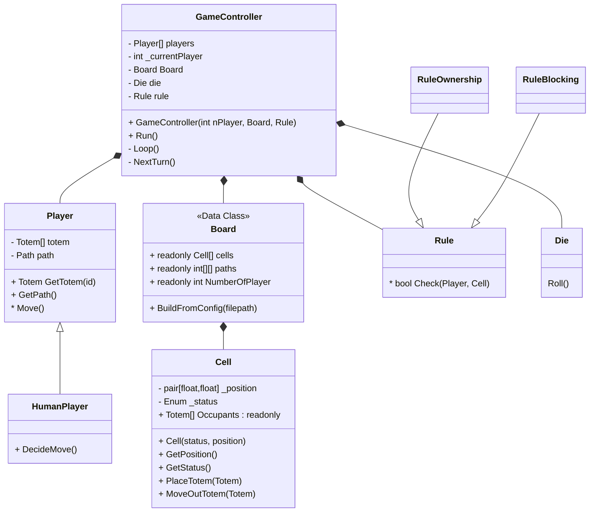

```mermaid
classDiagram
    class Player{
        - Totem[] totem
        - Path path
        + Totem GetTotem(id)
        + GetPath()
        * Move()
    }
    class HumanPlayer{
        + DecideMove()
    }


    class Cell{
        - pair[float,float] _position
        - Enum _status
        + Totem[] Occupants : readonly
        + Cell(status, position)
        + GetPosition()
        + GetStatus()
        + PlaceTotem(Totem)
        + MoveOutTotem(Totem)
    }

    class Board{
        <<Data Class>>
        + readonly Cell[] cells
        + readonly int[][] paths
        + readonly int NumberOfPlayer
        + BuildFromConfig(filepath)
    }

    class Rule{
        * bool Check(Player, Cell)
    }
    class RuleBlocking{

    }
    class RuleOwnership{

    }

    class GameController{
        - Player[] players
        - int _currentPlayer
        - Board Board
        - Die die
        - Rule rule
        
        + GameController(int nPlayer, Board, Rule)
        + Run()
        - Loop()
        - NextTurn()

    }

    class Die{
        Roll()
    }


    RuleBlocking  --|> Rule
    RuleOwnership --|> Rule


    Player <|-- HumanPlayer

    GameController *-- Player
    GameController *-- Board
    GameController *-- Rule
    GameController *-- Die

    Board *-- Cell

```