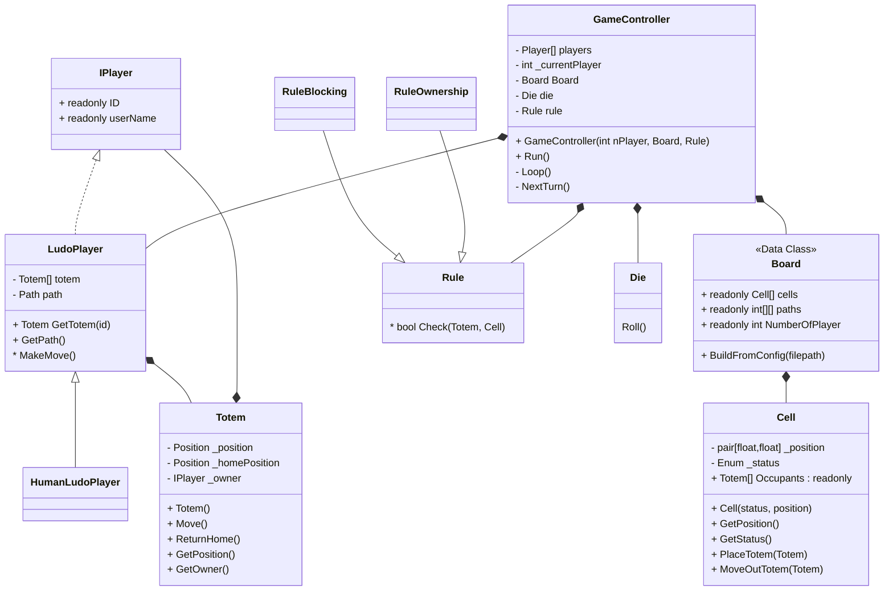
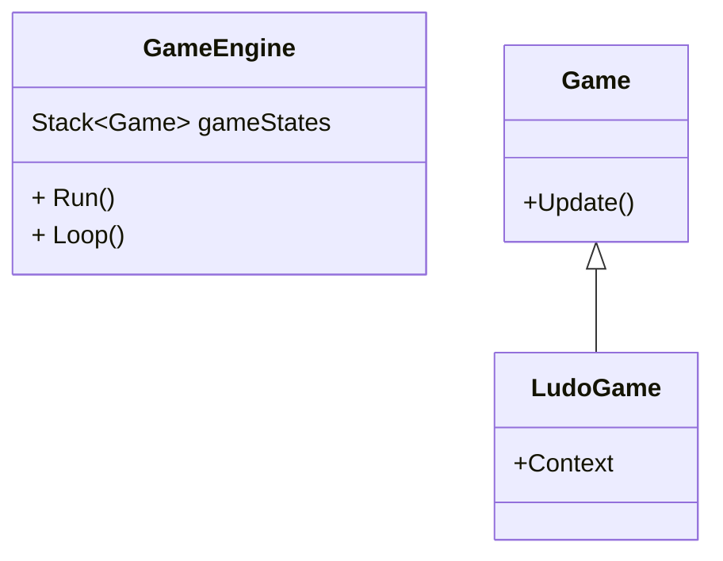

```mermaid
classDiagram

    class IPlayer{
        + readonly ID
        + readonly userName
    }
    class LudoPlayer{
        - Totem[] totem
        - Path path
        + Totem GetTotem(id)
        + GetPath()
        * MakeMove()
    }
    class HumanLudoPlayer{
    }

    class Totem{
        - Position _position
        - Position _homePosition
        - IPlayer _owner

        + Totem()
        + Move()
        + ReturnHome()
        + GetPosition()
        + GetOwner()
    }


    class Cell{
        - pair[float,float] _position
        - Enum _status
        + Totem[] Occupants : readonly
        + Cell(status, position)
        + GetPosition()
        + GetStatus()
        + PlaceTotem(Totem)
        + MoveOutTotem(Totem)
    }

    class Board{
        <<Data Class>>
        + readonly Cell[] cells
        + readonly int[][] paths
        + readonly int NumberOfPlayer
        + BuildFromConfig(filepath)
    }

    class Rule{
        * bool Check(Totem, Cell)
    }
    class RuleBlocking{

    }
    class RuleOwnership{

    }

    class GameController{
        - Player[] players
        - int _currentPlayer
        - Board Board
        - Die die
        - Rule rule
        
        + GameController(int nPlayer, Board, Rule)
        + Run()
        - Loop()
        - NextTurn()

    }

    class Die{
        Roll()
    }


    RuleBlocking  --|> Rule
    RuleOwnership --|> Rule

    IPlayer <|.. LudoPlayer
    LudoPlayer <|-- HumanLudoPlayer

    LudoPlayer *-- Totem
    Totem *-- IPlayer

    GameController *-- LudoPlayer
    GameController *-- Board
    GameController *-- Rule
    GameController *-- Die

    Board *-- Cell

```

---

---

```mermaid
classDiagram

class GameEngine{
    Stack~Game~ gameStates
    + Run()
    + Loop()
}

class Game{
    +Update()
}

class LudoGame{
    +Context
}


Game <|-- LudoGame

```