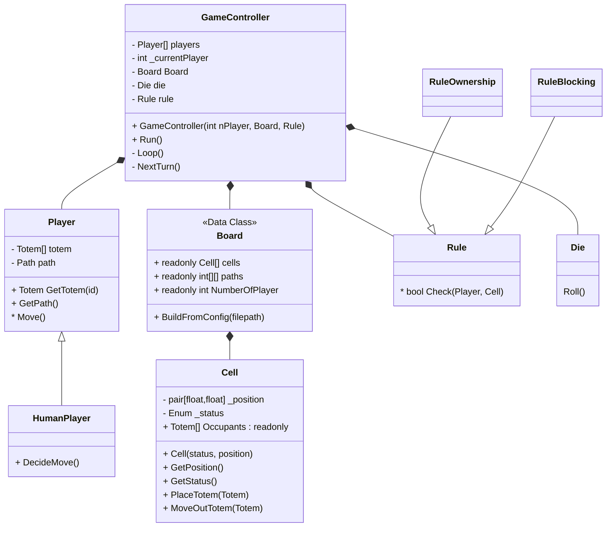
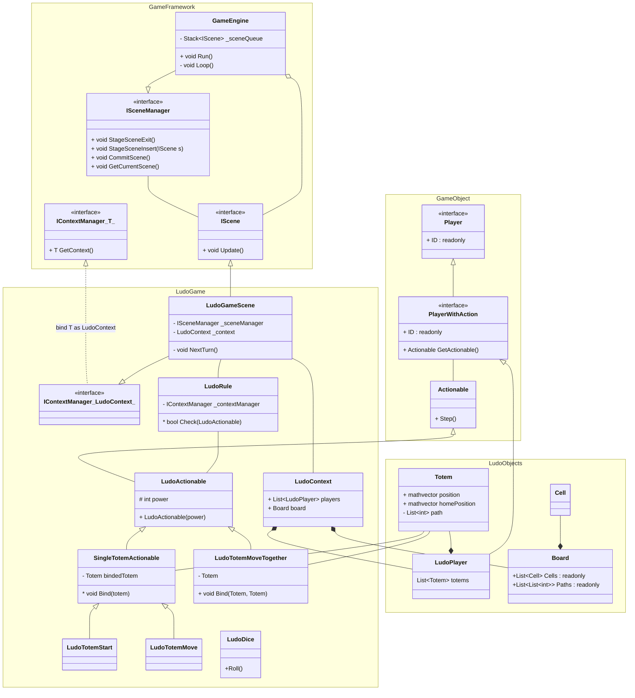
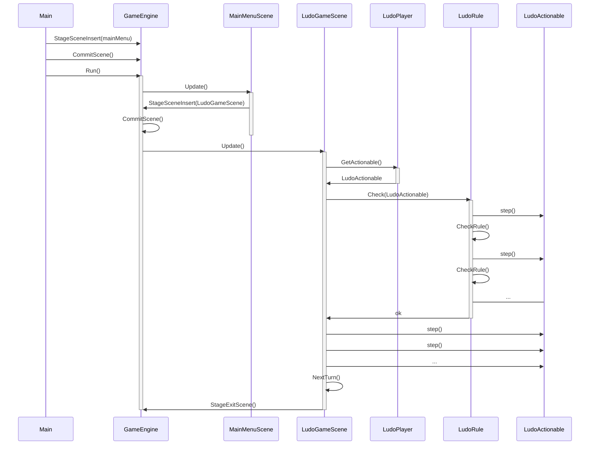

# Ludo Class Diagram

## Old Class Diagram

```mermaid
classDiagram
    class Player{
        - Totem[] totem
        - Path path
        + Totem GetTotem(id)
        + GetPath()
        * Move()
    }
    class HumanPlayer{
        + DecideMove()
    }


    class Cell{
        - pair[float,float] _position
        - Enum _status
        + Totem[] Occupants : readonly
        + Cell(status, position)
        + GetPosition()
        + GetStatus()
        + PlaceTotem(Totem)
        + MoveOutTotem(Totem)
    }

    class Board{
        <<Data Class>>
        + readonly Cell[] cells
        + readonly int[][] paths
        + readonly int NumberOfPlayer
        + BuildFromConfig(filepath)
    }

    class Rule{
        * bool Check(Player, Cell)
    }
    class RuleBlocking{

    }
    class RuleOwnership{

    }

    class GameController{
        - Player[] players
        - int _currentPlayer
        - Board Board
        - Die die
        - Rule rule
        
        + GameController(int nPlayer, Board, Rule)
        + Run()
        - Loop()
        - NextTurn()

    }

    class Die{
        Roll()
    }


    RuleBlocking  --|> Rule
    RuleOwnership --|> Rule


    Player <|-- HumanPlayer

    GameController *-- Player
    GameController *-- Board
    GameController *-- Rule
    GameController *-- Die

    Board *-- Cell

```

## Better Ludo Class Diagram

```mermaid
classDiagram
    namespace GameFramework{

        class ISceneManager{
            <<interface>>
            + void StageSceneExit()
            + void StageSceneInsert(IScene s)
            + void CommitScene()
            + void GetCurrentScene()
        }
        class GameEngine{
            - Stack~IScene~ _sceneQueue
            + void Run()
            - void Loop()
        }
        class IScene{
            <<interface>>
            + void Update()
        }

        class IContextManager_T_{
            <<interface>>
            + T GetContext()
        }
    }

    ISceneManager -- IScene
    GameEngine --|> ISceneManager
    GameEngine o-- IScene
    namespace GameObject{
        class Player{
            <<interface>>
            + ID : readonly
        }
        class PlayerWithAction{
            <<interface>>
            + ID : readonly
            + Actionable GetActionable()
        }
        class Actionable{
            + Step()
        }
    }
    Player <|-- PlayerWithAction
    PlayerWithAction -- Actionable

    namespace LudoGame{
        class IContextManager_LudoContext_{
            <<interface>>
        }

        class LudoContext{   
            + List~LudoPlayer~ players
            + Board board
        }

        class LudoGameScene{
            - ISceneManager _sceneManager
            - LudoContext _context
            - void NextTurn()
        }

        class LudoRule{
            - IContextManager _contextManager
            * bool Check(LudoActionable)
        }
        class LudoActionable{
            # int power
            + LudoActionable(power)
        }
        class SingleTotemActionable{
            - Totem bindedTotem
            * void Bind(totem)
        }
        class LudoTotemStart{
        }
        class LudoTotemMove{
        }
        class LudoTotemMoveTogether{
            - Totem
            + void Bind(Totem, Totem)
        }

        class LudoDice{
            +Roll()
        }
    }
    SingleTotemActionable <|-- LudoTotemStart
    SingleTotemActionable <|-- LudoTotemMove
    Actionable <|-- LudoActionable
    LudoActionable <|-- SingleTotemActionable
    LudoActionable <|-- LudoTotemMoveTogether
    LudoRule -- LudoActionable
    LudoGameScene -- LudoRule

    IScene <|-- LudoGameScene
    IContextManager_T_ <|.. IContextManager_LudoContext_ : bind T as LudoContext
    LudoGameScene -- LudoContext
    LudoGameScene --|> IContextManager_LudoContext_


    

    namespace LudoObjects{
        class LudoPlayer{
            List~Totem~ totems
        }


        class Board{
            +List~Cell~ Cells : readonly
            +List~List~int~~ Paths : readonly

        }

        class Cell{

        }

        class Totem{
            + mathvector position
            + mathvector homePosition
            - List~int~ path
        }

    }
    Cell --* Board
    Totem --* LudoPlayer
    PlayerWithAction <|-- LudoPlayer
    LudoContext *-- Board
    LudoContext *-- LudoPlayer 

    Totem -- LudoTotemMoveTogether
    Totem -- SingleTotemActionable
    


```

## Rough Sequence Diagram

```mermaid
sequenceDiagram
    Main->>GameEngine: StageSceneInsert(mainMenu)
    Main->>GameEngine: CommitScene()
    Main->>GameEngine: Run()
    activate GameEngine
        GameEngine ->> MainMenuScene: Update()
        activate MainMenuScene
            MainMenuScene ->> GameEngine: StageSceneInsert(LudoGameScene)
            GameEngine ->> GameEngine: CommitScene()
        deactivate MainMenuScene

        GameEngine ->> LudoGameScene: Update()
        activate LudoGameScene
            LudoGameScene ->> LudoPlayer: GetActionable() 
            activate LudoPlayer
            LudoPlayer->>LudoGameScene : LudoActionable
            deactivate LudoPlayer
            LudoGameScene ->> LudoRule : Check(LudoActionable)
            activate LudoRule
                LudoRule ->> LudoActionable : step()
                LudoRule ->> LudoRule : CheckRule()
                LudoRule ->> LudoActionable : step()
                LudoRule ->> LudoRule : CheckRule()
                LudoRule -> LudoActionable : ...
                LudoRule ->> LudoGameScene : ok
            deactivate LudoRule

            LudoGameScene ->> LudoActionable : step()
            LudoGameScene ->> LudoActionable : step()
            LudoGameScene ->> LudoActionable : ...

            LudoGameScene ->> LudoGameScene : NextTurn()

            LudoGameScene ->> GameEngine : StageExitScene()
        deactivate LudoGameScene


    deactivate GameEngine

```
